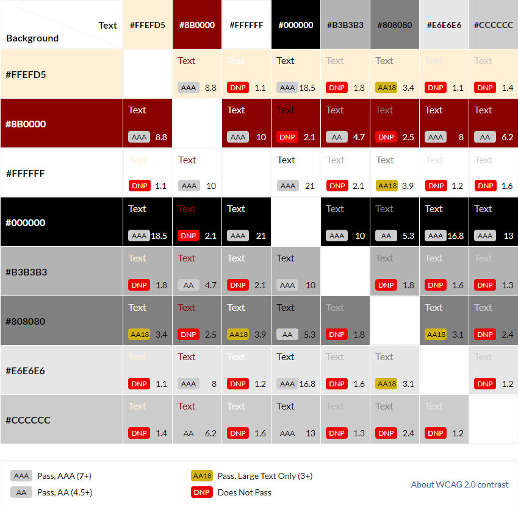
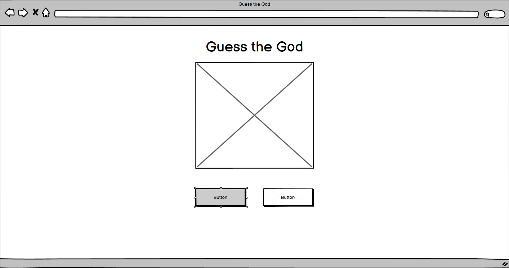
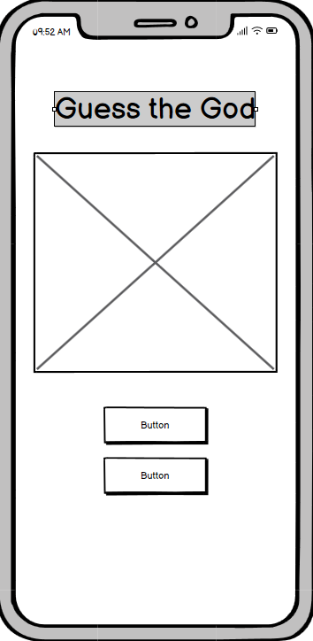
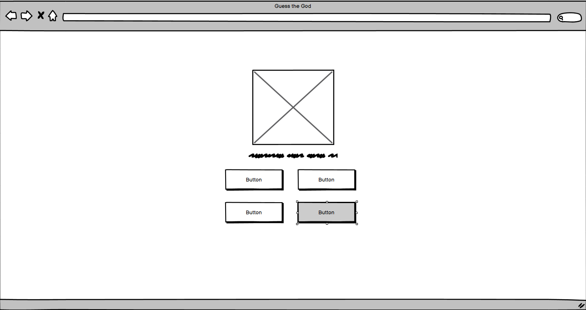
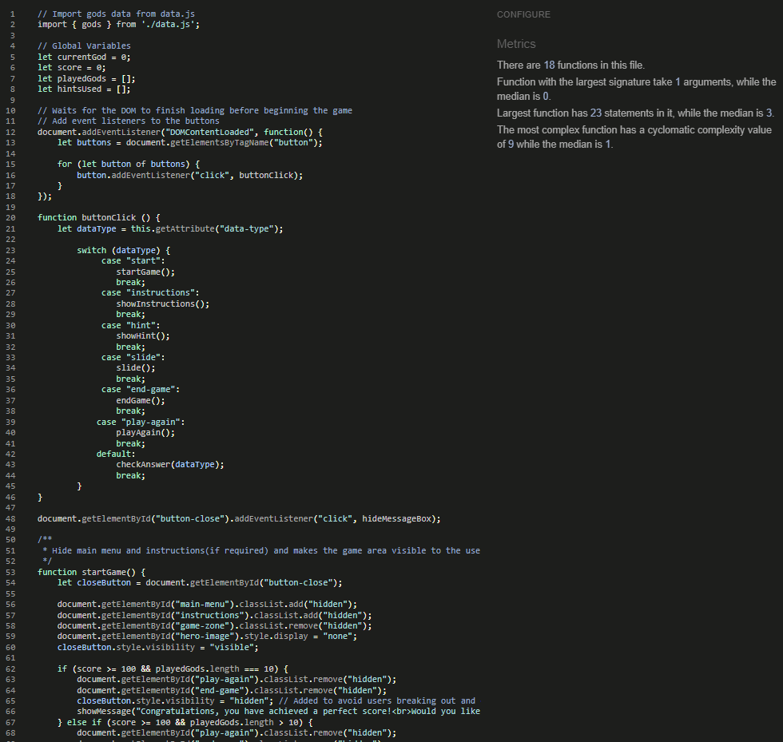
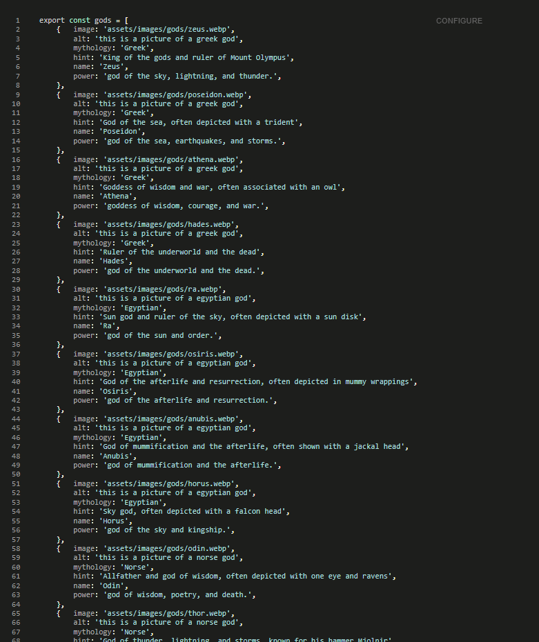

# Guess The God

A link to the website is **[here](https://shlackka.github.io/guess-the-god/)**.

Guess the God is an engaging and educational quiz where players are presented with images of gods from various mythologies. The objective is to correctly identify which pantheon each god belongs to Greek, Norse, Egyptian, or Aztec. This fun and interactive game helps players familiarize themselves with the distinctive visual characteristics and attributes of deities from different cultures. Perfect for mythology enthusiasts and curious learners alike, this quiz offers a visual and entertaining way to deepen your knowledge of ancient pantheons.

**Table of contents:**

- [Title](#guess-the-god)
- [User Experience](#user-experience-ux)
  - [Expectation](#expectation)
  - [User Journey](#user-journey)
- [Design](#design)
  - [Colour Scheme](#colour-scheme)
  - [Typography](#typography)
  - [Imagery](#imagery)
  - [Wireframes](#wireframes)
- [Features](#features)
  - [Languages Used](#languages-used)
  - [Existing Features](#existing-features)
  - [Features Not Yet Implemented](#features-not-yet-implemented)
- [Testing](#testing)
  - [Validator Testing](#validator-testing)
  - [Unfixed Bugs](#unfixed-bugs)
- [Deployment](#deployment)
- [Credits](#credits)
  - [Content](#content)
  - [Media](#media)

## User Experience (UX)

  - ### Expectation
    - **Clear Instructions**: Users look for clear and concise instructions on how to play the game.

    - **Simple Navigation**: Navigation of the game is simple and intuitive.

    - **Feedback**: Users expect and receive immediate feedback from each and every action performed whilst playing the game.

    - **Educational**: Users receive new and interesting pieces of information upon playing the game.

    - **Responsive Design**: Whether playing on mobile or desktop the game works well and as expected on both.

  - ### User Journey
    - **Landing Page**: Users are welcomed with a nicely styled door which upon clicking the button in the centre of the screen will open to the main menu.  
    This experience is slightly different on mobile as the first screen will be the main menu.

    - **Main Menu**: A clear choice of either start game or how to play is shown to the user.

    - **Question Screens**: Each question displays an 
    image of a god with multiple-choice options to select the correct pantheon with the option to also get a hint.

    - **Feedback**: After selecting an answer, users 
    receive immediate feedback on whether they were correct, with additional information about the god.

    - **Completion**: At the end of the quiz, users are offered an encouraging message on their performance  
    and offered a choice to play again or to end the game and be returned to the main menu/closed door depending on platform.

## Design

  - ### Colour Scheme
    - I chose these colours to create a visually striking and immersive experience that reflects the grandeur and mystique of mythology, with the dark red conveying a sense of ancient power, while the black and white provide clear, readable text and elements that stand out against the light, neutral background.

    - The colour palette below was created using **[Contrast Grid](https://contrast-grid.eightshapes.com)**

      

  - ### Typography
    - The primary font is 'Lato', sans-serif for general text, providing a clean and modern look. 
    
    - 'Vollkorn', serif is used for headings to add a touch of elegance and distinction.
    
    - All fonts were acquired through **[Google Fonts](https://fonts.google.com/)**.

  - ### Imagery
    - High-quality images of gods from different mythologies are used to create a visually engaging and educational experience.  
    The images are central to the quiz, helping users associate visual characteristics with each god.
    
    - All god images were created with the help of **[ChatGPT](https://chatgpt.com/?oai-dm=1)**.

  - ### Languages Used
    - **HTML5**: Used for structuring the content of the web pages. HTML5 provides the semantic elements and structure necessary for a well-organized and accessible web application.
    
    - **CSS3**: Used for styling the web pages. CSS3 ensures that the application has a visually appealing and consistent design. It includes the use of Flexbox and Grid for layout, and media queries for responsiveness.
    
    - **JavaScript**: Used for adding interactivity to the web application. JavaScript powers the game's logic, user interactions, dynamic content updates, and animations.  
    Aswell as the use of modules to improve readability and scalability in the future.
    
    - **Markdown**: Used to write the README.

  - ### Wireframes

Please see below the original wireframes of the site made using Balsamiq Wireframes.

- ### Main Menu (Desktop)

- ### Main Menu (Mobile)

- ### Game Zone

## Features

Below I will go into a brief explanation of the features I have encorporated into the game.

- ### Existing Features

- __Landing Page (Desktop)__

    - Shown upon loading the site on desktop, an attractive image used to introduce the site with minimal wording. 
    - A central button offering an intriguing message of "Enter the Pantheon" inviting users to click and continue onto the main title screen.
    - The sliding effect of the main image on the desktop landing page offers a feeling of grandeur as the main title page is unveiled.

- __Landing Page/Title Page (Mobile)__

    - The mobile landing page, although missing the sliding feature image of the desktop version still offers the same asthetic with a identical title page.
    - A simple to use title page main menu offering the options of "Start Game" and "How to Play" with an attractive hero image to give a distinct feel to the game.

- __Instructions__

    - When the "How to Play" button is clicked a message window will open to give all the relevant instrutions the player will need.
    - The instructions window includes it's own "Start Game" button to avoid needing to return to the main menu.

- __Game Zone__

    - A stylised image of a god will appear central to the player.
    - A question will display below the god image "To which mythology does this god/goddess belong?".
    - The answer buttons are displayed clearly below the question each in the same style as the main site.
    - A hint button is displayed below the answer buttons clearly stating the repercussion for using a hint.

- __Score__

    - A score keeping area is displayed below the buttons.

- __Alert Box (Answer)__

    - For each action the player performs a message box will appear central to the screen.
    - Uses an "x" in the top right corner as a close button.
    - Will give the player feedback on their chosen answer whether it was right or wrong.

- __Alert Box (Hint)__

    - Will give the player a hint dependant on the current god/goddess displayed.
    - The hint can be displayed as many times as the player would like for each god/goddess.

- __Alert Box (End Game)__

    - The message box will contain 2 buttons upon reaching an end game state "End Game" and "Play Again".
    - The "x" in the top right will not appear for this message so as not to present an unwanted loop in game.

### Features Not Yet Implemented

- __Gladiator Dropdown__

    - I had planned to implement a dropdown on the gladiators information page to work on smaller screens much like the nav menu.
    - This would have only shown the relevant information for the chosen gladiator rather than having the whole page as a long scrollable page.

## Testing

Each feature of the site has been tested upon integration and also tested again upon completion of development, these tests will be outlined below.

- The Nav bar was tested by confirming each link lead to the correct page which I can confirm is the case this was repeated for each page where the nav bar was present.

- The footer, similarly to the nav bar was tested by confirming each link lead to the correct social media page, this was repeated for every page with the footer bar.

- All buttons that are present within the site have been tested by confirming that once activated they perform the correct action, the button on the index leads to the information page and the buttons on the 404 and thank you pages leads back to the index page.

- The audio playback features on the information page have all been confirmed to play the correct audio clip for their relevant section. 

- The sign up form has had all relevant inputs tested to confirm that they will request input when left empty with the email input specifically requesting for an email format with an @ symbol.

- The submit button is confirmed to lead to the thank you page upon successful completion of all relevant inputs on the form.

Along with feature testing I have also run lighthouse tests, these have come back very positive as seen below with the screen captures.

- Lighthouse report for main page

- Lighthouse report for information page

- Lighthouse report for signup form page

### Validator Testing

- __HTML__
    - No errors were returned when passing through the official [W3C validator](https://validator.w3.org/nu/?showsource=yes&doc=https%3A%2F%2Fshlackka.github.io%2Fguess-the-god%2F)
- __CSS__
    - No errors were returned when passing through the official [(Jigsaw) validator](https://jigsaw.w3.org/css-validator/validator?uri=https%3A%2F%2Fshlackka.github.io%2Fguess-the-god%2F&profile=css3svg&usermedium=all&warning=1&vextwarning=&lang=en)
- __JavaScript__
    - No errors were returned when passing through **[JSHint](https://jshint.com/)** as shown in the images below.

    
    

### Unfixed Bugs

To the best of my knowledge after testing all aspects of the site I have been unable to find any unfixed bugs.

## Deployment

The site has been deployed to GitHub pages, in order to do this the following steps were completed.

- From within the Gladiatour repo I navigated to the settings tab

- In settings navigate to the Pages section under "Code and automation"

- Once in Pages, I chose to deploy from a branch as my source and then chose the Main branch before clicking save

- The deployed site can be found at **https://shlackka.github.io/Gladiatour/index.html**

If you wish to fork the repo this can be achieved by using the "Fork" button at the top of the repo.

If you wish to clone the repo this can be achieved by using the drop down on the green "code" button and copying the URL into a workspace of your choosing such as **[Gitpod](https://www.gitpod.io/)** or **[CodeAnywhere](https://codeanywhere.com/)**.

## Credits 

In the below section I will go over all of the external sources where I either drew inspiration or used their tools to assist in the development of Gladiatour.

### Content

 - The text for the main index page and information page was taken from **[ChatGPT](https://chatgpt.com/?oai-dm=1)** with minor changes by myself. (All text within the README has been typed by myself).

 - **[ChatGPT](https://chatgpt.com/?oai-dm=1)** has been used to help explain any concepts I may have been struggling to understand, this was used more at the beginning of development with it tapering off as I became more confident.

 - The icons for the footer and the arrow for the dropdown on mobile were taken from **[Font Awesome](https://fontawesome.com/)**.

 - For the initial development of this site I took inspiration from the practice project I completed prior, which can be found **[here](https://github.com/Shlackka/Love-Running)**.

 - Fonts for the site were found using **[Google Fonts](https://fonts.google.com/)**.

### Media

- The audio clips for the information page were created using **[Voice Generator](https://voicegenerator.io/)**.

- All images including those used as backgrounds have been created using the DALL-E AI image creator through **[ChatGPT](https://chatgpt.com/?oai-dm=1)** by OpenAI.

- Favicon was created using **[Red Ketchup](https://redketchup.io/favicon-generator)**.